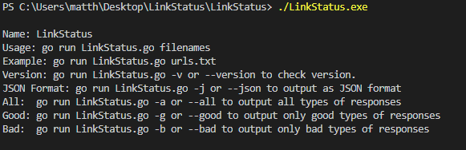
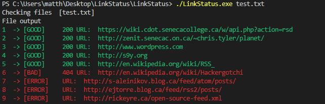
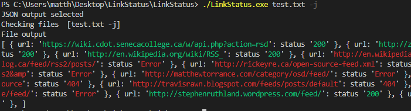
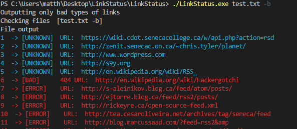

# LinkStatus Release v1.0.1

LinkStatus reads a supplied file, finds, and checks links via a GET request. The program returns the status codes of the links and lists them for the user in colour. A few test files are included within the project.

This program was developed using the GO programming language.

# Introduction
Hello to the person reading this. This is my release 0.1 project for the DPS909 class. The class is about open source development and this project had us use git and communicate with one another to solve problems we had during development.

I have a blog going alongside the development of this project and future projects for this class which you can find [here](https://matthew-k-stewardson.blogspot.com/).

## Usage

After installing, navigate to any directory and run any of the following commands:

To recieve help information run the program with no arguments:



```go
LinkStatus
```

To see the current version run:
```go
LinkStatus -v or --version
```
To run the program with a file and check the links use:



```go
LinkStatus filename
```
To output the data in JSON format:



```go
LinkStatus filename -j or --json
```

To output all url response types:
```go
LinkStatus filename -a or --all
```
To output only good url response types:
```go
LinkStatus filename -g or --good
```
To output only bad url response types:



```go
LinkStatus filename -b or --bad

```
To ingnore url patterns in ignore.txt:
```go
LinkStatus filename -i or --ignore
```

## Libraries Used
- [net http](https://golang.org/pkg/net/http/): Used to handle the GET requests and Timeout features
- [regexp](https://golang.org/pkg/regexp/): Used to search for http and https links in a string
- [fatih color](https://github.com/fatih/color): USed to bring colour to the console output
- [pflag](https://github.com/spf13/pflag): Used to add the optional -v or --version command line arguments

## License
[MIT](https://choosealicense.com/licenses/mit/)
